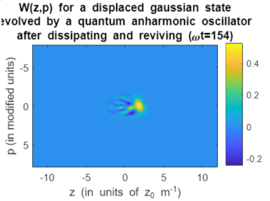

# Quantum Phase-Space Visualization Toolkit (MATLAB)

A MATLAB toolkit for visualizing quantum states in phase space using the Wigner quasi-probability distribution. Covers the quantum harmonic oscillator (QHO), squeezed states, and anharmonic oscillator dynamics — including the formation of negative-valued Wigner functions that signal genuine non-classical behavior.



*Wigner function W(z,p) of a displaced Gaussian state evolved under a quantum anharmonic oscillator potential at ωt=154. The negative-valued fringes to the left of the main lobe are a direct signature of non-classical coherence partially reviving after the state's initial spread ("dissipation") in phase space.*

---

## Contents

| File | Description |
|------|-------------|
| `wignerHO.m` | Full simulation and analysis script |
| `demo_anharmonic.m` | Self-contained demo: anharmonic oscillator + Wigner revival (see §Demo below) |

---

## Units and Conventions

All quantities are expressed in dimensionless "natural" QHO units. Lengths are in units of z₀ = √(ℏ/mω), momenta in units of p₀ = √(ℏmω), and time in units of 1/ω. In these units the ground-state uncertainty product is σ_x · σ_p = 1/4 = ℏ/2, and the SHO Hamiltonian takes the form H = p²/2 + z²/2.

The momentum-space representation is obtained via a symmetrically normalized FFT:

```
ψ̃(p) ≈ (dz/√π) · fftshift(fft(ifftshift(ψ(z))))
```

so that ∫|ψ̃(p)|² dp = 1 whenever ∫|ψ(z)|² dz = 1.

---

## Core Functions

### `gridint(grid, vals)`

Trapezoidal numerical integration of `vals` over `grid`.

**Inputs**
- `grid` — 1×N real row vector of sample points (need not be uniform, but typically is)
- `vals` — M×N array; each row is a function to integrate over `grid`

**Output**
- `int` — M×1 column vector of integral values (one per row of `vals`)

**Example**
```matlab
dz = 0.05;
zgrid = -10:dz:10;
psi = SHOmode(zgrid, 0);
norm_check = gridint(zgrid, abs(psi).^2);  % should be ≈ 1.0
```

---

### `Hermite(grid, n)`

Evaluates the n-th (physicists') Hermite polynomial Hₙ on a discrete grid using the three-term recurrence H₀ = 1, H₁ = 2z, Hₙ = 2z·Hₙ₋₁ − 2(n−1)·Hₙ₋₂.

**Inputs**
- `grid` — 1×N real row vector of evaluation points
- `n` — non-negative integer order

**Output**
- `eval` — 1×N array of Hₙ(grid)

**Example**
```matlab
zgrid = linspace(-4, 4, 200);
H3 = Hermite(zgrid, 3);   % = 8z³ − 12z
plot(zgrid, H3);
```

---

### `SHOmode(grid, n)`

Returns the n-th normalized energy eigenfunction of the quantum harmonic oscillator:

ψₙ(z) = Hₙ(z) · exp(−z²/2) / ‖·‖

**Inputs**
- `grid` — 1×N real row vector (position values in units of z₀)
- `n` — non-negative integer quantum number

**Outputs**
- `shosol` — 1×N normalized wavefunction ψₙ(grid)
- `norm` — pre-normalization L² norm (useful for checking grid resolution)

**Example**
```matlab
dz = 0.1;
zgrid = -15:dz:15;
[psi2, ~] = SHOmode(zgrid, 2);   % second excited state
plot(zgrid, psi2);
xlabel('z / z_0');  ylabel('\psi_2(z)');
```

To decompose an arbitrary state into the first M eigenmodes:
```matlab
M = 12;
modes = zeros(M, length(zgrid));
for n = 0:M-1
    modes(n+1, :) = SHOmode(zgrid, n);
end
coeffs = gridint(zgrid, mystate .* modes);   % M×1 coefficient vector
```

---

### `W(psi, dz)`

Computes the Wigner quasi-probability distribution for a pure state ψ(z):

W(z, p) = (1/π) ∫ ψ*(z+s) ψ(z−s) e^{2ips} ds

The algorithm evaluates the density matrix on each anti-diagonal of phase space via a direct 1D FFT per position slice, then uses scattered interpolation (`scatteredInterpolant` with `'natural'` method) to resample onto a regular (z, p) grid.

> **Note:** The output grid dimensions differ from the input `zgrid`. Always use the returned `modzgrid` and `modpgrid` for axis labels and further integration.

**Inputs**
- `psi` — 1×N complex row vector (wavefunction on a uniformly spaced, origin-centered grid)
- `dz` — scalar grid spacing of the input position grid

**Outputs**
- `outvals` — N×(N−2) real array; rows index position z, columns index momentum p
- `modzgrid` — 1×N position axis for `outvals`
- `modpgrid` — 1×N momentum axis for `outvals`

> **Normalization:** ∫∫ W(z,p) dz dp = 1. Marginals satisfy ∫ W(z,p) dp = |ψ(z)|² and ∫ W(z,p) dz = |ψ̃(p)|².

**Basic example — squeezed vacuum state:**
```matlab
dz = 0.1;
zgrid = (-150:150) * dz;               % origin-centered, length N = 301
squeezed = sqrt(2) * SHOmode(2*zgrid, 0);

[Wsq, modzgrid, modpgrid] = W(squeezed, dz);

imagesc(modzgrid, modpgrid, Wsq);
colorbar;  daspect([1 1 1]);
title('W(z,p) — squeezed vacuum');
xlabel('z (units of z_0)');  ylabel('p (modified units)');
```

**Checking marginals:**
```matlab
prob_x = gridint(modpgrid, Wsq.');      % integrate over p → |ψ(z)|²
prob_p = gridint(modzgrid, Wsq);        % integrate over z → |ψ̃(p)|²
disp(gridint(modpgrid, prob_p));        % should print ≈ 1.0
```

**Grid size guidance:** Runtime scales as O(N²) in memory and O(N² log N) in compute. N = 301 (the default in the script, dz = 0.1, zgrid spanning ±15) runs in a few seconds. Increasing N beyond ~500 is only needed for high-momentum resolution.

---

## Demo: Anharmonic Oscillator + Wigner Revival

The script's final section (`demo_anharmonic.m`) is the most physically striking standalone demonstration. It shows:

1. **State preparation** — a displaced Gaussian (coherent) state centered at z = 2z₀, decomposed into the first 8 eigenstates of the anharmonic Hamiltonian H = p²/2 + z²/2 + 0.02·z⁴.

2. **Phase-space "dissipation"** — by ωt ≈ 50 the Wigner function has spread and acquired negative fringes, reflecting wavepacket decoherence within the pure-state anharmonic evolution.

3. **Fractional revival** — by ωt ≈ 154 the wavepacket partially refocuses and the negative fringes re-emerge in a structured way (see header image), a hallmark of quantum recurrence in anharmonic systems.

4. **Optional MP4 output** — uncomment the block at the end of the script to export the full evolution as `wigneranhocohmov.mp4`.

**To run the demo:**
```matlab
% Requires: wignerHO.m (for function definitions) to be on the MATLAB path,
% or copy the four functions (gridint, Hermite, SHOmode, W) into the same file.

dz = 0.1;
zgrid = -15:dz:15;
firstncoh = 8;

% Build Hamiltonian eigenstates
[shomodes, ~] = deal(zeros(firstncoh, length(zgrid)));
for i = 1:firstncoh
    shomodes(i,:) = SHOmode(zgrid, i-1);
end

% Anharmonic Hamiltonian (finite difference)
symize = @(M)(M + M');
hmat = diag((1/dz)^2 + 0.5*zgrid.^2) ...
     - (1/dz)^2/2 * symize([zeros(length(zgrid)-1,1) eye(length(zgrid)-1); zeros(1,length(zgrid))]);
hmat_anho = hmat + 0.02 * diag(zgrid.^4);

[anhovecs, anhovalmat] = eigs(hmat_anho, firstncoh, 'smallestabs');
firstnanhovals = diag(anhovalmat);
anhovecnorms = arrayfun(@(v) sqrt(gridint(zgrid, abs(v{:}.').^2)), num2cell(anhovecs, 1));
normalized_anhovecs = anhovecs ./ anhovecnorms;

% Initial displaced Gaussian
cohstate = SHOmode(zgrid - 2, 0);
coeffsanhocoh = gridint(zgrid, cohstate .* normalized_anhovecs');

% Time evolution
wtanhogrid = 0:0.5:250;
anhocohmovie = coeffsanhocoh .* exp(-1i * wtanhogrid.' * firstnanhovals.') * normalized_anhovecs.';

% Plot Wigner function at revival time ωt = 154  (frame index 309)
[Wrevival, modzgrid, modpgrid] = W(anhocohmovie(310,:), dz);
imagesc(modzgrid, modpgrid, Wrevival);
colorbar;  daspect([1 1 1]);
title({'W(z,p) for a displaced Gaussian state', ...
       'evolved by a quantum anharmonic oscillator', ...
       'after dissipating and reviving (\omega{}t=154)'});
xlabel('z (in units of z_0 m^{-1})');
ylabel('p (in modified units)');
```

Expected output: a peaked positive lobe near the initial displacement z ≈ 2, with a characteristic fan of negative fringes extending toward the origin — matching the header image above.

---

## Dependencies

- MATLAB R2019b or later (uses `scatteredInterpolant`, `eigs`, `VideoWriter`)
- No external toolboxes required

---

## Physical Background

The Wigner function is a phase-space representation of a quantum state that encodes the full quantum statistics of both position and momentum simultaneously. Unlike a classical probability distribution, it can take **negative values** — a direct indicator of non-classical behavior (e.g. superpositions, squeezed states, Fock states with n ≥ 1). This makes it a natural diagnostic tool for studying decoherence, entanglement, and the quantum-to-classical transition.

For a comprehensive introduction, see:
- Walls & Milburn, *Quantum Optics*, Ch. 3–4
- Leonhardt, *Measuring the Quantum State of Light* (Cambridge, 1997)
- Schleich, *Quantum Optics in Phase Space* (Wiley-VCH, 2001)
